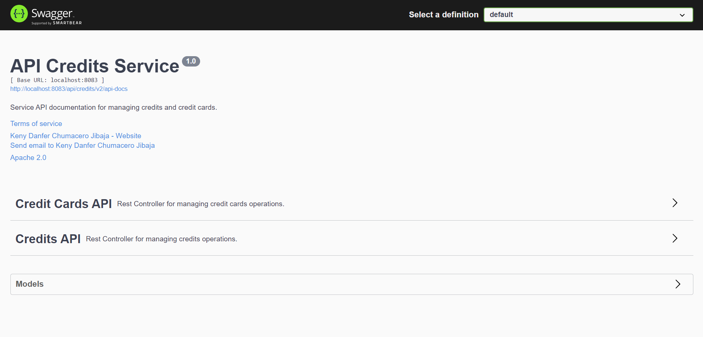
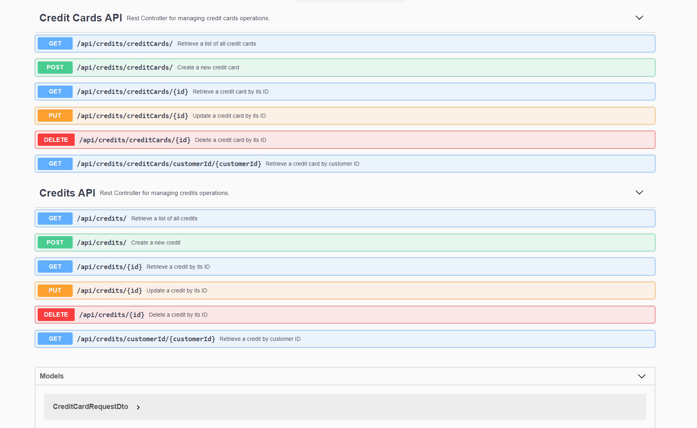

 

    <h3 align="center">CREDITS SERVICE</h3>
    <h4 align="center">NTT DATA - Escuela 2023</h4>
    <h4 align="center">Keny Danfer Chumcaro Jibaja</h4>
    

        Service to manage the credits that a bank offers to customers.
        This service is part of the solution to the project Proposed at the Ntt Data Java School, September 2023.
    

### Built With

* 
* 
* 
* 
* 

<!-- GETTING STARTED -->
## Getting Started

To get a local copy up and running follow these steps.

### Prerequisites

* JDK 11
* Maven
* MySQL

### Recommended Tools
* 
  [https://www.jetbrains.com/idea/download/](https://www.jetbrains.com/idea/download/)
* 
  [https://www.postman.com/downloads/](https://www.postman.com/downloads/)

## Documentation in Swagger
- To view the documentation for this project in Swagger, run the project and go to: [http://localhost:8083/api/credits/swagger-ui/index.html#/](http://localhost:8083/api/credits/swagger-ui/index.html#/)

- Here you can see the following

